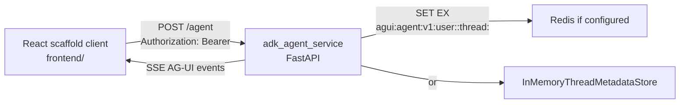

# AG-UI -> ADK Agent Service

This folder is the smallest useful FastAPI runtime slice for a React AG-UI client, a Google ADK-backed Agent Service, and thread metadata storage. It intentionally excludes Auth0, supervisor workflows, OBO token exchange, egress gateways, MCP services, observability sidecars, and orchestration outside ADK.

The `frontend/` folder is a scaffold client that models how a real React application uses the official `@ag-ui/client` `HttpAgent` and `AgentSubscriber` APIs. `frontend/src/aguiClient.ts` is the browser-to-agent client boundary.

## Service Boundary



The Agent Service treats the incoming bearer value as opaque. It does not validate, introspect, forward, or store the raw token. This flow requires `X-User-Id`; in the full stack, the service boundary should derive that user context from validated auth.

Redis is the preferred metadata store when `REDIS_URL` is configured and reachable. The in-memory store is a local developer fallback only. Both stores use the same metadata shape: `user_id`, `thread_id`, `session_id`, `agent_session_id`, and `updated_at`.

## Runtime Contract

The Agent Service has one execution path:

1. Receive an AG-UI `RunAgentInput` at `POST /agent`.
2. Derive `sessionId` from AG-UI `threadId`.
3. Strip client-supplied `sessionId` and `session_id` from request state.
4. Write thread metadata through the configured store.
5. Invoke `ag_ui_adk.ADKAgent.run(...)`.
6. Stream AG-UI events encoded by `ag_ui.encoder.EventEncoder`.

`ANTHROPIC_API_KEY` and model-provider settings are read only by the Agent Service process.

Long-lived specialist processes are intentionally out of scope for this app. They require routing and lifecycle semantics beyond the documented AG-UI/ADK bridge and would make this runtime larger without improving the streamable response path.

## Run

Install Python dependencies from this directory:

```bash
uv sync
```

Optional model configuration using an untracked `.env` file:

```bash
cp .env.example .env
```

Start the FastAPI app:

```bash
set -a
. ./.env
set +a
uv run uvicorn adk_agent_service.app:app --host 127.0.0.1 --port 18088
```

If Redis is not reachable and `AGENT_SERVICE_METADATA_STORE=auto`, the service uses the in-memory metadata store when `AGENT_SERVICE_ALLOW_IN_MEMORY_FALLBACK=true`.

Smoke request:

```bash
curl -N http://127.0.0.1:18088/agent \
  -H 'Content-Type: application/json' \
  -H 'Authorization: Bearer demo-token' \
  -H 'X-User-Id: demo-user' \
  -d '{
    "threadId": "thread-001",
    "runId": "run-001",
    "messages": [{"id": "msg-001", "role": "user", "content": "Summarize this ADK runtime."}],
    "tools": [],
    "context": [],
    "state": {},
    "forwardedProps": {}
  }'
```

## Frontend

Run the React scaffold client in a separate terminal:

```bash
cd frontend
npm install
npm run dev
```

Open `http://127.0.0.1:5173`. The Vite dev server proxies `/agent` to the FastAPI app at `http://127.0.0.1:18088`, so the browser never receives model-provider credentials.

Override `VITE_AGENT_SERVICE_URL` if your FastAPI app uses a different host or port.

## Windows Start

On Windows, the stack can run from one launcher when Redis is available or when in-memory fallback is allowed. The script loads `.env`, checks for `uv`, `npm`, Windows Terminal, and Redis, then opens separate tabs for FastAPI and the React scaffold client:

```powershell
pwsh -ExecutionPolicy Bypass -File .\scripts\start-local.ps1
```

If Redis is unavailable, the script sets `AGENT_SERVICE_METADATA_STORE=memory` unless `-DisableInMemoryFallback` is supplied.
