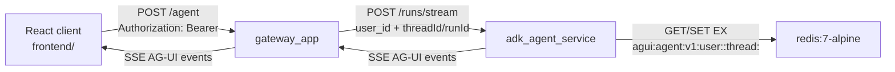

# AG-UI -> ADK Agent Service -> Redis

This folder is the smallest useful runtime slice for the AG-UI gateway container, the ADK Agent Service container, Redis, and a React client. It intentionally excludes Auth0, supervisor workflows, OBO token exchange, egress gateways, MCP containers, observability sidecars, and any workflow orchestration outside ADK.

The `frontend/` folder uses the official `@ag-ui/client` `HttpAgent` and `AgentSubscriber` APIs. `frontend/src/aguiClient.ts` is the browser-to-agent client boundary.

## Service Boundary



The gateway treats the incoming bearer value as opaque. It does not validate, introspect, forward, or store the raw token. This flow requires `X-User-Id` and forwards only that user id. In the full stack, the gateway should derive that user context from validated auth; this slice keeps auth intentionally out of scope.

The Agent Service owns the Redis metadata store and the ADK bridge. Redis keys use the conventional colon-separated namespace shape:

```text
agui:agent:v1:user:<uid>:thread:<threadId>
```

Each Redis value is a single JSON document with `user_id`, `thread_id`, `session_id`, `agent_session_id`, and `updated_at`. Entries are written with a TTL via Redis `SET ... EX`.

## Runtime Contract

The Agent Service has one execution path: build an AG-UI `RunAgentInput`, invoke `ag_ui_adk.ADKAgent`, and encode the resulting AG-UI events with `ag_ui.encoder.EventEncoder`. Redis is run metadata only; ADK is the only agent execution substrate. The gateway derives the Agent Service `sessionId` from `threadId` so browsers cannot choose a separate persistence key. `ANTHROPIC_API_KEY` and `ANTHROPIC_MODEL` are read only by the Agent Service process.

Long-lived specialist processes are intentionally out of scope for this stack. They would require routing and lifecycle semantics beyond the documented AG-UI/ADK bridge and would make the service boundary larger without improving the streamable response path.

Research inputs used for this shape:

- AG-UI documents `HttpAgent` and `AgentSubscriber` as the client-side HTTP/SSE and event-subscription abstraction.
- AG-UI Python documents typed streaming events and `EventEncoder` as the server-side event encoding boundary.
- `ag_ui_adk` documents `ADKAgent.run(...)` and FastAPI integration as the Google ADK bridge for AG-UI events.
- Redis documents colon-delimited key conventions and `SET` options such as expiration.

## Run

From this directory, build the shared `python-base` image first, then build and start the three runtime containers. Both backend services use `backend.Dockerfile`; Compose supplies only the service module, service path, and port as build args, so there are no per-service Dockerfiles in this stack.

```bash
docker compose build python-base
docker compose up --build
```

For Podman environments where `--secret` can be passed to `podman build` but not `podman compose build`, prebuild the two backend images with the Makefile. The Makefile passes the same service args that Compose uses and forwards the pip config as the `pip_config` build secret:

```bash
make podman-build-backends \
  PIP_CONFIG_SECRET_SRC=/path/to/pip.conf
podman compose up --no-build
```

Override `CONTAINER_ENGINE`, `AG_UI_GATEWAY_IMAGE`, or `AGENT_SERVICE_IMAGE` if your enterprise Podman setup uses different command or image naming conventions.

Optional ADK model configuration using Anthropic from an untracked `.env` file:

```bash
cp ../../.env .env
docker compose up --build
```

Smoke request:

```bash
curl -N http://127.0.0.1:18088/agent \
  -H 'Content-Type: application/json' \
  -H 'Authorization: Bearer demo-token' \
  -H 'X-User-Id: demo-user' \
  -d '{
    "threadId": "thread-001",
    "runId": "run-001",
    "messages": [{"id": "msg-001", "role": "user", "content": "Summarize this ADK runtime."}],
    "state": {}
  }'
```

Inspect the Redis metadata entry:

```bash
docker compose exec redis redis-cli --scan --pattern 'agui:agent:v1:*'
docker compose exec redis redis-cli get 'agui:agent:v1:user:demo-user:thread:thread-001'
```

The Redis container is published on host port `6380` by default to avoid collisions with an existing developer Redis. Override `REDIS_HOST_PORT` in `.env` if needed.

## Frontend

Run the React client in a separate terminal:

```bash
cd frontend
npm install
npm run dev
```

Open `http://127.0.0.1:5173`. The Vite dev server proxies `/agent` to the AG-UI gateway at `http://127.0.0.1:18088`, so the browser never receives the Anthropic API key or any other model-provider credential.

The gateway is published on host port `18088` by default to avoid collisions with the full developer stack. The Agent Service is private to the Compose network; the browser and host tools should enter through the gateway. Override `AG_UI_GATEWAY_HOST_PORT` or `VITE_AG_UI_GATEWAY_URL` if needed.

## Windows Start Without Docker

On Windows, the stack can run without Docker when Redis is available. The script loads `.env` from this folder, checks for `uv`, `npm`, Windows Terminal, and Redis, then opens separate tabs for the Agent Service, AG-UI gateway, and React frontend:

```powershell
pwsh -ExecutionPolicy Bypass -File .\scripts\start-local.ps1
```

Docker-free startup requires Redis at `REDIS_URL` or `redis-server` on `PATH`. If Redis is not already running and `redis-server` is not available, the script stops before launching the app.
