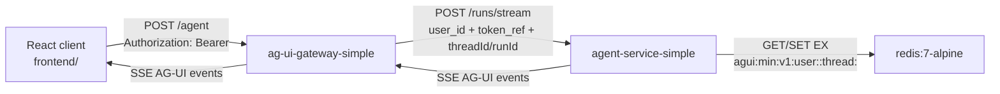

# Minified AG-UI -> Agent Service -> Redis

This folder is the smallest useful runtime slice for the AG-UI container, the Agent Service container, and Redis. It intentionally excludes Auth0, supervisor workflows, OBO token exchange, egress gateways, MCP containers, observability sidecars, and frontend coupling.

The `frontend/` folder is a minimal React client for the same boundary. It uses the official `@ag-ui/client` `HttpAgent` and `AgentSubscriber` APIs; `frontend/src/a2aClient.ts` remains the app-to-agent client entrypoint and re-exports the AG-UI client wrapper in `frontend/src/aguiClient.ts`.

## Service Boundary



The gateway treats the incoming bearer value as opaque. It does not validate, introspect, or store the raw token. For this minified flow it derives a stable `user_id` from `X-User-Id`, an unverified JWT identity claim when present, or a token fingerprint fallback. The forwarded `token_ref` is always a SHA-256 fingerprint.

The Agent Service owns the Redis cache and the agent runtime boundary. Redis keys use the conventional colon-separated namespace shape:

```text
agui:min:v1:user:<uid>:thread:<threadId>
```

Each cache entry is a single JSON document with `user_id`, `thread_id`, `session_id`, `agent_session_id`, `messages`, `state`, `run_count`, and `updated_at`. Entries are written with a TTL via Redis `SET ... EX`.

## Runtime Contract

The Agent Service constructs one `PersistentAdkRuntime` per FastAPI process. That runtime keeps a process-local coordinator and stateful subagent instances alive across requests. When live ADK credentials are configured, it delegates AG-UI event translation to the official `ag_ui_adk.ADKAgent` middleware; otherwise it runs a deterministic local dispatcher that emits the same typed AG-UI event classes through `ag_ui.encoder.EventEncoder`. `ANTHROPIC_API_KEY` and `ANTHROPIC_MODEL` are read only by the Agent Service process.

The coordinator/dispatcher pattern is intentionally simple:

- The coordinator receives only sanitized request context and cached thread state.
- The dispatcher routes each turn to one long-lived specialist process object.
- Redis is the cross-process cache of thread state; ADK session state is the in-process execution substrate owned by `ADKAgent`.
- The AG-UI event stream remains the public UI contract: `RUN_STARTED`, `TEXT_MESSAGE_START`, `TEXT_MESSAGE_CONTENT`, `TEXT_MESSAGE_END`, `STATE_DELTA`, and `RUN_FINISHED` or `RUN_ERROR`.

Research inputs used for this shape:

- AG-UI documents `HttpAgent` and `AgentSubscriber` as the client-side HTTP/SSE and event-subscription abstraction.
- AG-UI Python documents typed streaming events and `EventEncoder` as the server-side event encoding boundary.
- `ag_ui_adk` documents `ADKAgent.run(...)` and FastAPI integration as the Google ADK bridge for AG-UI events.
- ADK documents coordinator/dispatcher as a central coordinator routing to specialized sub-agents.
- Redis documents colon-delimited key conventions and `SET` options such as expiration.

## Run

Build the shared `python-base` image first, then build and start the three runtime containers:

```bash
cd minified/agui-agent-redis
docker compose build python-base
docker compose up --build
```

Optional live ADK configuration using Anthropic from an untracked `.env` file:

```bash
cp ../../.env .env
export AGENT_SERVICE_RUNTIME_MODE=auto
docker compose up --build
```

Local smoke request:

```bash
curl -N http://127.0.0.1:18088/agent \
  -H 'Content-Type: application/json' \
  -H 'Authorization: Bearer local-demo-token' \
  -H 'X-User-Id: demo-user' \
  -d '{
    "threadId": "thread-001",
    "runId": "run-001",
    "messages": [{"id": "msg-001", "role": "user", "content": "Summarize this minified runtime."}],
    "state": {"sessionId": "session-001"}
  }'
```

Inspect the Redis cache entry:

```bash
docker compose exec redis redis-cli --scan --pattern 'agui:min:v1:*'
docker compose exec redis redis-cli get 'agui:min:v1:user:demo-user:thread:thread-001'
```

The Redis container is published on host port `6380` by default to avoid collisions with an existing local Redis. Override `REDIS_HOST_PORT` in `.env` if needed.

## Frontend

Run the React client in a separate terminal:

```bash
cd minified/agui-agent-redis/frontend
npm install
npm run dev
```

Open `http://127.0.0.1:5173`. The Vite dev server proxies `/agent` to the AG-UI gateway at `http://127.0.0.1:18088`, so the browser never receives the Anthropic API key or any other model-provider credential.

The gateway is published on host port `18088` and the Agent Service on host port `18090` by default to avoid collisions with the full local stack. Override `AG_UI_GATEWAY_HOST_PORT`, `VITE_AG_UI_GATEWAY_URL`, or `AGENT_SERVICE_HOST_PORT` if needed.
